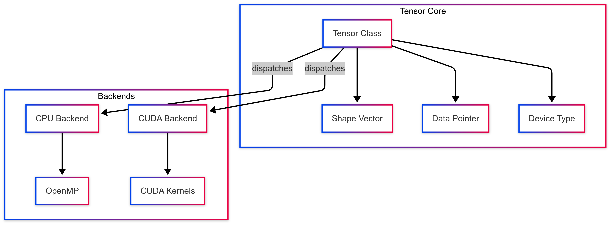
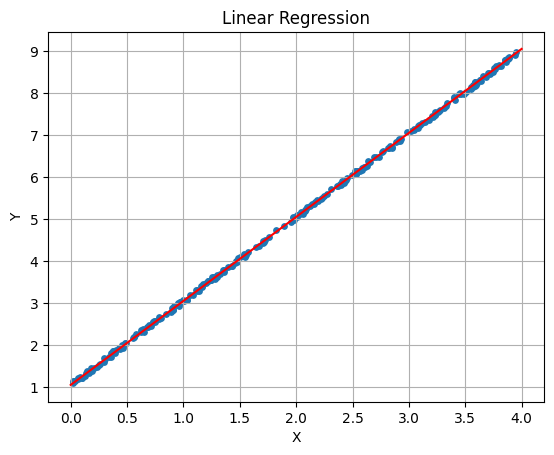
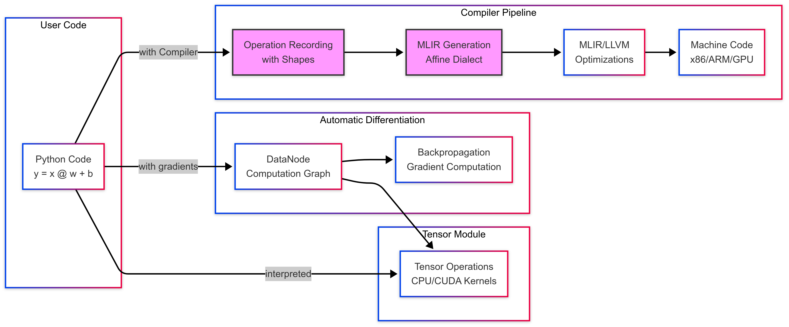

# 🚀 FDUAI

## A High-Performance Tensor Computation Framework
### with Automatic Differentiation and MLIR Compilation

<br>

⚡ **From Interpreted to Compiled: 450× Performance Boost**

<br>
<br>

**Contributors**

杨润东 • 杨淳瑜 • 王海天


<table>
    <tr>
        <td> tensor_module.Device.CPU </td>
        <td> 杨润东 </td>
    </tr>
    <tr>
        <td> tensor_module.Device.CUDA </td>
        <td> 杨淳瑜 </td>
    </tr>
    <tr>
        <td>fduai.autograd </td>
        <td> 杨润东 </td>
    </tr>
    <tr>
        <td>  fduai.common </td>
        <td> 杨润东 </td>
    </tr>
    <tr>
        <td> fduai.compiler </td>
        <td> 杨润东 </td>
    </tr>
    <tr>
        <td> fduai.runner.cpu </td>
        <td> 杨润东 </td>
    </tr>
    <tr>
        <td> fduai.runner.cuda </td>
        <td> 王海天 </td>
    </tr>
    <tr>
        <td> examples </td>
        <td> 王海天 </td>
    </tr>
    <tr>
        <td> report writing </td>
        <td> 杨淳瑜 </td>
    </tr>
</table>


---

# Tensor Module Implementation

## A High-Performance Foundation for Deep Learning

- **Unified abstraction** across CPU and CUDA devices
- **NumPy-compatible** broadcasting semantics
- **Zero-copy** Python integration
- **Optimized** parallelization strategies

---

# Architecture Overview



---

## NumPy-Compatible Shape Inference


```py
t1 = Tensor.from_list([[0], [10], [20], [30]])
assert t1.shape == list((4, 1))

t2 = Tensor.from_list([[1, 2, 3]])
assert t2.shape == list((1, 3)) 

assert (t1 + t2).to_list() == [[1.0, 2.0, 3.0], 
                               [11.0, 12.0, 13.0], 
                               [21.0, 22.0, 23.0], 
                               [31.0, 32.0, 33.0]]
```

## Conversion to/from Numpy Array

> We implemented buffer protocol, a general and convenient way to exchange data between different languages and libraries.

```py
>>> from tensor_module import *
>>> a = Tensor.from_list([1,2,3])
>>> np.array(a)
array([1., 2., 3.], dtype=float32)
>>> b = Tensor.from_numpy(a)
>>> b.to_list()
[1.0, 2.0, 3.0]
>>> assert b.to_list() == [1., 2., 3.]
```

---

# CUDA Kernel Design

## Template-Based Generic Broadcasting

```cpp
template <typename Op>
__global__ void broadcastOpKernel(const float *a, const float *b, 
                                 float *result, Op op) {
    int idx = blockIdx.x * blockDim.x + threadIdx.x;
    if (idx < num_elements) {
        // Convert flat index to multi-dimensional
        int indices[8] = compute_indices(idx);
        
        // Map with broadcasting rules
        int a_idx = map_index(indices, a_shape);
        int b_idx = map_index(indices, b_shape);
        
        result[idx] = op(a[a_idx], b[b_idx]);
    }
}
```

**Benefits**: 
- Compile-time specialization
- Zero function call overhead
- Reusable across operations

---

## Key Takeaways

- **Unified API** - Same code works on CPU/CUDA
- **Compatibility** - NumPy broadcasting semantics
- **Element-wise ops**: Near-memory bandwidth limited
- **Broadcasting**: Zero-copy on CPU, efficient on CUDA

## Foundation for Higher Layers
- Automatic differentiation builds on tensor operations
- Compiler can optimize across abstraction boundaries

---


# Automatic Differentiation System

---

## Dynamic Computation Graphs for Deep Learning


## Implementation

```python
class DataNode:
    def __init__(self, tensor, requires_grad=True):
        self.tensor = tensor          # Actual data
        self.grad = None             # Accumulated gradient
        self.inputs = []             # Dependencies
        self.op = Operator.NONE      # Operation type
        DataNode.topological_order.append(self)  # Global tracking
```

**Innovation**: 
- Static topological ordering eliminates graph traversal
- Nodes recorded in creation order
- Implicit dependency tracking

---

### Automatic Graph Building

```python
def __add__(self, other):
    # Forward computation
    t = self.tensor + other.tensor
    ret = DataNode(t, requires_grad=False)
    
    # Record graph structure
    ret.op = Operator.ADD
    ret.inputs = [self, other]
    ret.requires_grad = self.requires_grad or other.requires_grad
    
    return ret
```

### Reverse-Mode Differentiation

```python
def backward(self, grad=None):
    # Initialize gradient for loss
    if grad is None:
        grad = Tensor.ones(self.shape())
    
    # Operation-specific gradient computation
    if self.op == Operator.MUL:
        # Product rule
        self.inputs[0]._add_grad(grad * self.inputs[1].tensor)
        self.inputs[1]._add_grad(grad * self.inputs[0].tensor)
        
    # Recurse to inputs (respecting topological order)
    for input in self.inputs:
        input.backward(input.grad)
```

---

## Supported Operations

> See [fduai.common.op](./fduai/common/op.py) for all supported operations.

| Operation      | Forward   | Gradient Rule                                |
| -------------- | --------- | -------------------------------------------- |
| Addition       | a + b     | ∂L/∂a = ∂L/∂out, ∂L/∂b = ∂L/∂out             |
| Multiplication | a × b     | ∂L/∂a = ∂L/∂out × b, ∂L/∂b = ∂L/∂out × a     |
| MatMul         | A @ B     | ∂L/∂A = ∂L/∂out @ B^T, ∂L/∂B = A^T @ ∂L/∂out |
| ReLU           | max(0, x) | ∂L/∂x = ∂L/∂out × (x > 0)                    |
| ...            | ...       | ...                                          |

---


## Linear Regression in 10 Lines

```python
# Initialize parameters
w = DataNode(Tensor.zeros((n_features, 1)))
b = DataNode(Tensor.zeros((1,)))

# Training loop
for _ in range(100):
    # Forward pass
    predictions = DataNode.matmul(X, w) + b
    loss = (predictions - Y) ** 2
    
    # Backward pass (computes all gradients)
    loss.backward()
    
    # Update parameters
    w.tensor -= w.grad * learning_rate
    b.tensor -= b.grad * learning_rate
    
    DataNode.zero_grad()
```



---

**Benefits**:
- No manual gradient formulas
- Automatic broadcasting handling
- Clean, readable code
- Easy debugging (inspect any gradient)

---

# From Tensors to Machine Code: Compiler Infrastructure

---

## System Architecture Overview



---

## Why Compilation? The Performance Gap

- **No cross-operation optimization**: Each op is a black box

## Solution: MLIR-Based Compilation

**MLIR** (Multi-Level Intermediate Representation)
- Designed for heterogeneous hardware
- Progressive lowering through dialects
- Reusable optimization infrastructure
- "Write once, optimize everywhere"

---

# Recording Operations for Compilation

## Translate Python Code into Our Internal IR

```python
from fduai.compiler import *
with Compiler() as compiler:
    a = Variable.zeros([2,2])
    b = Variable.ones([1,2])
    c = a + b

# ('fill', '%v0', (0.0,))
# ('fill', '%v1', (1.0,))
# ('+', '%v2', ('%v0', '%v1'))
```

---

### MLIR Code Generation：`y = x @ w + b`

```mlir
func.func @forward(%v0: memref<10x10xf32>,    // weights
                   %v1: memref<1x10xf32>,     // bias
                   %v2: memref<16x10xf32>)    // input
                   -> memref<16x10xf32> {
  %v3 = memref.alloc() : memref<16x10xf32>
  
  // Matrix multiplication: v3 = v2 @ v0
  affine.for %i = 0 to 16 {
    affine.for %j = 0 to 10 {
      %sum = arith.constant 0.0 : f32
      affine.for %k = 0 to 10 {
        %a = memref.load %v2[%i, %k]
        %b = memref.load %v0[%k, %j]
        %prod = arith.mulf %a, %b : f32
        %sum = arith.addf %sum, %prod : f32
      }
      memref.store %sum, %v3[%i, %j]
    }
  }
  
  // Bias addition with broadcasting
  // ... similar loop structure ...
}
```

---

## Compilation Results: Dramatic Performance Gains

`fduai` implementation:

```py
with Module() as m:
    with Function('main') as f:
        lr = Variable.fill([1,], 0.0001)
        w = DataNode.ones([1, 1])
        b = DataNode.zeros([1, 1])

        with Repeat(128):
            l = DataNode.matmul(x, w) + b - y
            loss = l * l
            loss.backward()

            w_n = w.tensor - lr * w.grad
            b_n = b.tensor - lr * b.grad
            move(w_n, w.tensor)
            move(b_n, b.tensor)

            DataNode.zero_grad()

        print(w.tensor)
        print(b.tensor)
```
---

Mean execution time of training a linear regression model across 100 runs:

| Implementation     | Time (ms) | Speedup  |
| ------------------ | --------- | -------- |
| FDUAI Interpreted  | 333.23    | 1×       |
| PyTorch            | 13.69     | 24×      |
| **FDUAI Compiled** | **0.74**  | **450×** |

### Performance Gains
- **450× speedup** over interpreted autograd
- **18× faster** than PyTorch

---

# Experiments

- **Basic Tensor Operations**
- **Automatic Differentiation Overhead**
- **Compilation Impact**

---

# Experimental Setup

## Benchmark Configuration

- **Tensor Dimensions**
  - Basic operations: 1000×1000 matrices
  - Broadcast operations: 1000×1000 matrix and scalar
---

## Mlir Pass Pipeline

```py
# add necessary memory free operations
auto_dealloc_pass = PassPipeline('--buffer-deallocation')

# accelerate the affine dialect
affine_accelerate_pass = PassPipeline(
    '--affine-simplify-structures',
    '--affine-loop-fusion',
    '--affine-parallelize',
    '--affine-loop-unroll',
    '--affine-super-vectorize',
)

# convert dialects to llvm dialect
convert_to_llvm_pass = PassPipeline(
    '--lower-affine',
    '--convert-scf-to-cf',
    '--convert-to-llvm',
    '--reconcile-unrealized-casts',
)
```
---

## Basic Tensor Operations Performance

```py
shape = [1000, 1000]
with Module() as m:
    with Function('main'):
        a = Variable.zeros(shape)
        b = Variable.zeros(shape)
        with Timer():
            with Repeat(1000):
                c = a + b
```

| Operation     | Mlir(-O2) | NumPy    | Torch(CPU) | tensor_module(CPU) |
| ------------- | --------- | -------- | ---------- | ------------------ |
| add           | 260 μs    | 301 μs   | 15108 μs   | 403 μs             |
| mul           | 220 μs    | 302 μs   | 15107 μs   | 401 μs             |
| matmul        | 250 μs    | 16180 μs | 24775 μs   | 1023 μs            |
| transpose     | 100 μs    | 17.6 μs  | 38.9 μs    | 202.0 μs           |
| broadcast add | 100 μs    | 202 μs   | 15060 μs   | 211 μs             |

---

## Compilation Time

> Time required to translate fduai.ir into mlir(optimization level 2).

| Operation      | Time To Execute |
|---------------|------------------|
| add           | 147 ms           |
| mul           | 146 ms           |
| matmul        | 141 ms           |
| transpose     | 148 ms           |
| broadcast add | 138 ms           |

---

## Performance Characteristics

- **Variable Operations**: consistently faster than numpy and pytorch.
- **Mlir vs. tensor_module**: about 2-4x speedup
- **Transpose**: slower than pytorch and numpy

