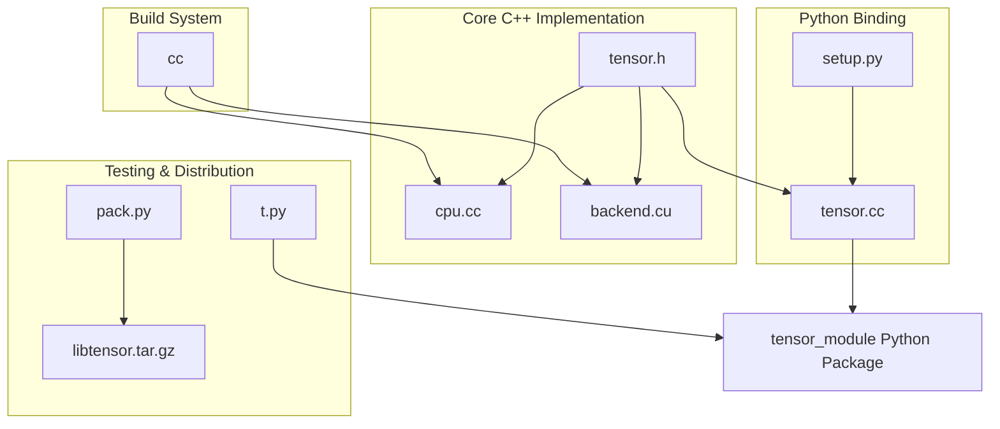

# Tensor Library

A high-performance tensor computation library with CPU and CUDA implementations, providing Python bindings through pybind11.

## Overview

This library implements a tensor computation system with the following features:
- Support for both CPU and CUDA (GPU) computation
- Basic tensor operations (creation, element access, arithmetic)
- Matrix operations (dot product)
- Seamless device transfer between CPU and CUDA
- NumPy interoperability
- Python bindings via pybind11

## Project Structure



### Components Explanation

#### Core C++ Implementation
- **tensor.h**: Header file defining the `Tensor` class, device types, and operation interfaces
- **cpu.cc**: CPU implementation of tensor operations (add, negate, dot product)
- **backend.cu**: CUDA/GPU implementation of tensor operations

#### Python Binding
- **tensor.cc**: Pybind11 code that creates Python bindings for the C++ Tensor class
- **setup.py**: Setup script for building the Python extension module

#### Build System
- **cc**: Custom compiler wrapper script that handles both C++ and CUDA code compilation
- **requirements.txt**: Dependencies needed for the project

#### Testing & Distribution
- **t.py**: Test script demonstrating tensor operations in Python
- **pack.py**: Packaging script to create distribution archive

## CUDA Programming Model: Threads, Blocks, and Grids

[CUDA编程实现矩阵乘法（代码解析）](https://blog.csdn.net/ing100/article/details/133705181)

CUDA uses a hierarchical structure to organize parallel computation and maps well to the architecture of modern GPUs. This section explains the key concepts and how they're applied in our matrix multiplication implementation.

### Parallel Computation Hierarchy

```
Grid
├── Block (0,0)  Block (0,1)  ...  Block (0,n)
├── Block (1,0)  Block (1,1)  ...  Block (1,n)
├── ...
└── Block (m,0)  Block (m,1)  ...  Block (m,n)
     │
     ├── Thread (0,0)  Thread (0,1)  ...  Thread (0,x)
     ├── Thread (1,0)  Thread (1,1)  ...  Thread (1,x)
     ├── ...
     └── Thread (y,0)  Thread (y,1)  ...  Thread (y,x)
```

#### Threads
- **Concept**: The smallest execution unit in CUDA
- **Execution**: Each thread runs the same kernel code but typically operates on different data
- **Identification**: Accessed via `threadIdx` variables (`threadIdx.x`, `threadIdx.y`, `threadIdx.z`)
- **Resources**: Each thread has its own registers and local memory

#### Blocks
- **Concept**: Groups of threads that can cooperate and synchronize
- **Properties**: 
  - Threads within a block can synchronize and share data via shared memory
  - Blocks are scheduled independently on available GPU resources
  - Can be 1D, 2D, or 3D organized
- **Identification**: Accessed via `blockIdx` variables (`blockIdx.x`, `blockIdx.y`, `blockIdx.z`)
- **Limitations**: Maximum number of threads per block is limited (typically 1024)

#### Grids
- **Concept**: Collection of blocks that execute the same kernel
- **Properties**:
  - Can be 1D, 2D, or 3D organized
  - Blocks within a grid cannot directly synchronize with each other
- **Usage**: Often maps to the overall problem dimensions

### CUDA Dot Product Implementation

Our matrix multiplication implementation in `cuda_dot` demonstrates these concepts:

```cpp
// CUDA kernel for matrix multiplication
__global__ void matmulKernel(const float *a, const float *b, float *c, int m, int n, int p)
{
    // a is [m, n] matrix, b is [n, p] matrix, c is [m, p] matrix
    int row = blockIdx.y * blockDim.y + threadIdx.y;
    int col = blockIdx.x * blockDim.x + threadIdx.x;
    
    if (row < m && col < p)
    {
        float sum = 0.0f;
        for (int k = 0; k < n; k++)
        {
            sum += a[row * n + k] * b[k * p + col];
        }
        c[row * p + col] = sum;
    }
}
```

#### Thread and Block Organization

In our implementation:

1. **Thread Calculation**:
   - Each thread computes one element of the result matrix C
   - The thread position is calculated using a combination of block and thread indices:
     ```cpp
     int row = blockIdx.y * blockDim.y + threadIdx.y;
     int col = blockIdx.x * blockDim.x + threadIdx.x;
     ```

2. **Block and Grid Dimensions**:
   - We use 2D blocks of 16×16 threads, which is a common block size for matrix operations:
     ```cpp
     dim3 threadsPerBlock(16, 16);
     ```
   - The grid dimensions are calculated to cover the entire output matrix:
     ```cpp
     dim3 blocksPerGrid((p + threadsPerBlock.x - 1) / threadsPerBlock.x,
                        (m + threadsPerBlock.y - 1) / threadsPerBlock.y);
     ```

3. **Kernel Launch**:
   - The kernel is launched with the calculated grid and block dimensions:
     ```cpp
     matmulKernel<<<blocksPerGrid, threadsPerBlock>>>(a.data, b.data, result.data, m, n, p);
     ```

#### Visual Representation of the Grid

For a 4×4 matrix multiplication, with 2×2 thread blocks:

```
Grid (2×2 blocks)
┌─────────┬─────────┐
│ Block   │ Block   │
│ (0,0)   │ (0,1)   │
│         │         │
├─────────┼─────────┤
│ Block   │ Block   │
│ (1,0)   │ (1,1)   │
│         │         │
└─────────┴─────────┘

Each Block (2×2 threads)
┌─────┬─────┐
│(0,0)│(0,1)│
├─────┼─────┤
│(1,0)│(1,1)│
└─────┴─────┘
```

#### Memory Access Pattern

In our matrix multiplication implementation:

1. Each thread reads multiple elements from matrices A and B:
   - For row `row` of A: `a[row * n + 0]` through `a[row * n + (n-1)]`
   - For column `col` of B: `b[0 * p + col]` through `b[(n-1) * p + col]`

2. Each thread writes a single element to matrix C:
   - `c[row * p + col]`

This pattern means each element from matrices A and B is read multiple times by different threads, which can create memory bandwidth bottlenecks. More advanced implementations would use shared memory to cache portions of the input matrices and reduce global memory accesses.

### Performance Considerations

1. **Block Size Choice**:
   - We chose 16×16 = 256 threads per block, which is a good balance:
     - Large enough to hide memory latencies
     - Small enough to fit in resources of a single Streaming Multiprocessor
     - Power of 2 for alignment efficiency

2. **Coalesced Memory Access**:
   - Adjacent threads access adjacent memory locations in matrix A, allowing for coalesced memory access
   - Memory accesses for matrix B are strided, which is less efficient

3. **Occupancy**:
   - The kernel uses minimal registers, allowing for high occupancy (many blocks can run concurrently)

A more advanced implementation would use techniques like tiling with shared memory to greatly improve performance, but our implementation provides a clear illustration of the CUDA execution model.

## Building and Installation

### Prerequisites
- CUDA Toolkit
- Python 3.x with NumPy
- pybind11

### Build Instructions

1. Install dependencies:
```bash
pip install -r requirements.txt
```

2. Build the extension module:
```bash
CC=$PWD/cc python setup.py build_ext --inplace
```

3. Run tests:
```bash
python t.py
```

## Usage Examples

```python
from tensor_module import Tensor, Device

# Create tensors
a = Tensor((2, 3), Device.CPU)  # Empty 2x3 tensor on CPU
b = Tensor.ones((2, 3), Device.CPU)  # 2x3 tensor filled with ones
c = Tensor.zeros((3, 2), Device.CPU)  # 3x2 tensor filled with zeros

# Element access
b[0] = 5.0  # Set first element

# Tensor operations
d = a + b  # Addition
e = Tensor.dot(b, c)  # Matrix multiplication

# Device transfer
b.to(Device.CUDA)  # Transfer to GPU
b.to(Device.CPU)   # Transfer back to CPU

# NumPy conversion
import numpy as np
np_array = np.array([[1.0, 2.0], [3.0, 4.0]], dtype=np.float32)
tensor = Tensor.from_numpy(np_array)
```

## Architecture

The library follows a layered architecture:
1. **Core Layer**: C++ implementation of tensor operations
2. **Device Layer**: Specialized implementations for CPU and CUDA
3. **Binding Layer**: Python bindings through pybind11
4. **User Interface**: Python API for end users

Operations are dispatched to the appropriate device implementation based on the tensor's device type.

## License

[Specify your license here] 