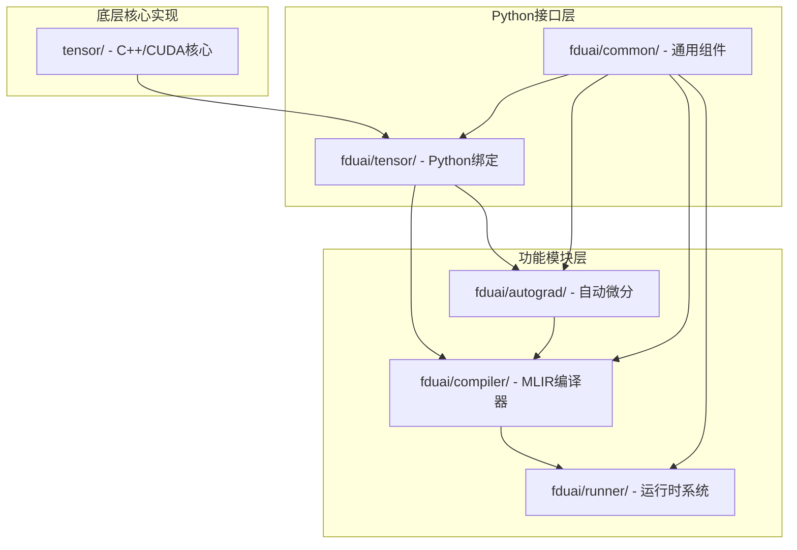

          
我需要查看项目的源代码以撰写一个全面的介绍。首先，我将查看项目的目录结构，了解整体架构。
        
            
toolName: view_folder
            
status: success
          
/home/castle/Code/fduai
          
现在我需要查看项目的核心文件，首先从tensor目录开始，了解张量库的实现。我将查看tensor.h文件，这应该包含了张量类的定义和核心接口。
        
            
toolName: view_files
            
status: success
          
            
filePath: /home/castle/Code/fduai/tensor/tensor.h
          
我需要继续查看tensor.h文件的更多内容，了解张量类的完整定义和操作。
        
            
toolName: view_files
            
status: success
          
            
filePath: /home/castle/Code/fduai/tensor/tensor.h
          
我需要查看更多关于张量操作的实现，特别是CPU和CUDA后端的实现。让我查看cpu.cc文件。
        
            
toolName: view_files
            
status: success
          
            
filePath: /home/castle/Code/fduai/tensor/cpu.cc
          
我需要查看CUDA后端的实现，了解GPU加速的实现方式。让我查看backend.cu文件。
        
            
toolName: view_files
            
status: success
          
            
filePath: /home/castle/Code/fduai/tensor/backend.cu
          
现在我需要了解自动微分系统的实现。让我查看fduai/autograd目录下的文件，特别是node.py，它可能包含了自动微分的核心实现。
        
            
toolName: view_files
            
status: success
          
            
filePath: /home/castle/Code/fduai/fduai/autograd/node.py
          
我需要了解MLIR编译器的实现，查看fduai/compiler目录下的文件，特别是ir.py，它可能包含了编译器的核心实现。
        
            
toolName: view_files
            
status: success
          
            
filePath: /home/castle/Code/fduai/fduai/compiler/ir.py
          
我需要了解编译器如何将操作转换为MLIR代码。让我查看fduai/compiler/scope.py文件，它可能包含了编译函数和模块的实现。
        
            
toolName: view_files
            
status: success
          
            
filePath: /home/castle/Code/fduai/fduai/compiler/scope.py
          
我需要了解运行时系统的实现，查看fduai/runner目录下的文件，特别是cpu.py，它可能包含了如何执行编译后的代码。
        
            
toolName: view_files
            
status: success
          
            
filePath: /home/castle/Code/fduai/fduai/runner/cpu.py
          
我需要查看一个示例，了解如何使用FDUAI进行实际计算。让我查看examples目录下的一个示例文件。
        
            
toolName: view_files
            
status: success
          
            
filePath: /home/castle/Code/fduai/examples/mixed/add.py
          
我需要查看一个自动微分的示例，了解如何使用FDUAI进行自动微分计算。让我查看examples/autograd目录下的一个示例文件。
        
            
toolName: view_files
            
status: success
          
            
filePath: /home/castle/Code/fduai/examples/autograd/linear_regresssion.ipynb
          
让我查看README.md文件，了解项目的整体描述和目标。
        
            
toolName: view_files
            
status: success
          
            
filePath: /home/castle/Code/fduai/README.md
          
我需要查看tensor/README.md文件，了解张量库的详细设计和实现。
        
            
toolName: view_files
            
status: success
          
            
filePath: /home/castle/Code/fduai/tensor/README.md
          
# FDUAI: 高性能张量与自动微分/编译框架

## 1. 引言 (Introduction)

### 1.1 项目背景与动机

随着深度学习和科学计算的快速发展，对高性能、可移植的计算库的需求日益增长。现有的深度学习框架如PyTorch和TensorFlow虽然功能强大，但在特定场景下可能存在性能瓶颈，且其复杂的架构使得定制化开发和优化变得困难。同时，随着硬件异构性的增加，如何高效地利用CPU和GPU等不同计算设备成为一个关键挑战。

MLIR (Multi-Level Intermediate Representation) 作为一种新兴的编译技术，为解决硬件异构和性能优化问题提供了新的可能性。它允许在高层次的抽象上进行优化，并能够生成针对不同硬件的高效代码。

FDUAI项目正是在这一背景下，旨在探索从底层张量实现到上层自动微分，再到编译器优化的全栈式框架构建。通过整合高性能计算、自动微分和编译优化技术，FDUAI致力于提供一个灵活、高效且易于使用的深度学习和科学计算框架。

### 1.2 项目目标

FDUAI项目的主要目标包括：

1. **实现高效、灵活的张量类**：构建一个支持CPU和CUDA后端的高性能张量库，提供基本的张量操作、矩阵运算、设备间无缝切换以及与NumPy的互操作性。

2. **构建自动微分系统**：在张量类的基础上，实现一个轻量级的自动微分引擎，支持动态计算图、前向和反向传播，为深度学习模型训练提供基础。

3. **引入MLIR编译器**：开发一个能够将Python计算图翻译成MLIR中间表示的编译器，通过MLIR的优化能力，生成高效的硬件代码，实现跨硬件的性能优化。

4. **展现项目逐步演进的过程**：通过清晰的模块划分和接口设计，展示从底层张量操作到高层自动微分和编译优化的完整技术栈，便于理解和扩展。

### 1.3 主要贡献

FDUAI项目的主要贡献包括：

1. **高性能张量库**：实现了一个集成C++/CUDA的Python张量库（tensor_module），支持CPU和GPU计算，提供与NumPy兼容的接口和广播机制，实现了高效的内存管理和设备间数据传输。

2. **轻量级自动微分引擎**：基于动态计算图实现了自动微分系统，支持常见的神经网络操作，能够自动计算梯度并进行反向传播，为深度学习模型训练提供支持。

3. **实验性MLIR编译器**：开发了一个能够将张量操作序列编译为MLIR并执行的编译器，通过记录指令将Python操作转换为中间表示，并利用MLIR的优化能力生成高效代码。

4. **性能评估与对比**：对基础操作（如矩阵加法、乘法）和简单模型（如线性回归）进行了性能评估，与NumPy和PyTorch进行了对比，结果表明FDUAI在基础运算上性能与NumPy相当，并优于PyTorch的开销。

### 1.4 系统架构

FDUAI采用分层架构设计，主要包括以下几个核心模块：

1. **tensor模块**：底层C++/CUDA实现的高性能张量库，通过pybind11提供Python绑定。该模块支持基本张量操作、矩阵运算、设备间无缝切换以及与NumPy的互操作性。

2. **autograd模块**：基于tensor模块构建的自动微分系统，实现了动态计算图、前向和反向传播、梯度累积等功能，为深度学习模型训练提供支持。

3. **compiler模块**：负责将Python计算图翻译成MLIR中间表示，包括变量作用域管理、指令记录和代码生成等功能。

4. **runner模块**：负责MLIR代码的编译、链接和执行，支持多种优化pass，能够生成高效的可执行代码。

5. **common模块**：提供操作符定义、底层库接口、MLIR方言等通用组件，为其他模块提供基础支持。

通过这种分层架构，FDUAI实现了从底层张量操作到高层自动微分和编译优化的完整技术栈，为深度学习和科学计算提供了一个灵活、高效的计算框架。

## 2. FDUAI 框架概览 (Framework Overview)

### 2.1 核心理念与设计哲学

FDUAI框架的设计理念源于对现代深度学习和科学计算系统的深入思考，旨在构建一个既高效又灵活的计算框架。其核心设计哲学可以概括为以下几个方面：

**分层设计与模块化**：FDUAI采用严格的分层架构，将系统划分为不同的抽象层次。最底层是高性能的C++/CUDA张量库，提供基础计算能力；中间层是Python友好的接口适配，使开发者能够以熟悉的方式使用底层功能；最上层则是应用功能模块，如自动微分和编译优化，为特定应用场景提供支持。这种分层设计不仅使系统结构清晰，还便于各模块的独立开发和测试，同时保证了模块间的良好协作。

**渐进式开发与演进**：FDUAI的开发遵循渐进式策略，从最基础的张量计算库开始，逐步扩展到自动微分系统，最终集成MLIR编译器。这种开发方式使得每个阶段都能产出可用的功能模块，并在此基础上不断迭代和完善。例如，张量库首先实现了基本的CPU后端，然后扩展到CUDA后端；自动微分系统先支持基础运算的梯度计算，再逐步添加更复杂的操作和优化；编译器部分则从简单的指令记录开始，逐步发展为完整的MLIR代码生成和优化流程。

**性能与易用性平衡**：FDUAI在设计中特别注重性能与易用性的平衡。一方面，通过C++/CUDA实现核心计算逻辑，确保高性能；另一方面，提供Python友好的接口，降低使用门槛。此外，FDUAI还引入了编译优化技术，在保持API简洁的同时，通过后端优化提升执行效率。

**硬件适应性与可扩展性**：考虑到计算硬件的多样性和快速发展，FDUAI设计了灵活的后端抽象，目前支持CPU和CUDA设备，未来可以方便地扩展到其他硬件平台。同时，MLIR的引入进一步增强了框架的硬件适应性，使得同一套代码可以针对不同硬件生成优化的执行代码。

**教学与研究导向**：作为一个学术项目，FDUAI特别注重代码的可读性和系统的可理解性，便于教学和研究使用。通过清晰的模块划分和详细的文档说明，FDUAI展示了从底层张量操作到高层自动微分和编译优化的完整技术栈，为深度学习框架的学习和研究提供了一个理想的平台。

### 2.2 系统架构

FDUAI框架采用模块化设计，各组件之间通过明确的接口进行交互，形成一个有机的整体。下面是FDUAI的系统架构图，展示了主要组件及其关系：



**tensor/ 目录**：这是FDUAI的核心基础，包含了C++/CUDA实现的高性能张量库。该模块定义了`Tensor`类及其基本操作，支持CPU和CUDA两种计算设备。主要文件包括：
- `tensor.h`：定义了`Tensor`类的核心数据结构和接口
- `cpu.cc`：实现了CPU后端的张量操作
- `backend.cu`：实现了CUDA后端的张量操作
- `tensor.cc`：实现了设备无关的张量操作和Python绑定

这一模块通过pybind11将C++实现的功能暴露给Python，形成`tensor_module`包，为上层应用提供高性能的计算基础。

**fduai/ 目录**：这是FDUAI的Python接口和功能模块层，包含多个子模块：

- **fduai/tensor/**：提供对底层`tensor_module`的封装和扩展，使其更符合Python用户的使用习惯。

- **fduai/autograd/**：实现了自动微分系统，核心是`DataNode`类，它封装了`Tensor`对象并记录计算图信息，支持自动梯度计算。该模块还包含初步的神经网络支持，如`linear`层实现。

- **fduai/compiler/**：实现了将Python计算序列转换为MLIR代码的编译器。核心类包括：
  - `Compiler`：作为上下文管理器，捕获和记录计算操作
  - `Variable`：表示计算中的变量，记录形状和类型信息
  - `Instruction`：表示计算指令，记录操作类型和涉及的变量
  - `Function`/`Module`/`Scope`：支持结构化编程，管理变量作用域

- **fduai/runner/**：负责MLIR代码的编译、链接和执行。核心组件包括：
  - `CPURunner`：将MLIR代码编译为目标文件并链接为可执行文件
  - `PassPipeline`：应用MLIR优化pass，如循环融合、并行化等
  - 辅助库：如`fence.c`（内存屏障）、`printer.c`（张量打印）、`timer.cpp`（性能计时）

- **fduai/common/**：提供各模块共用的基础组件，如：
  - `Operator`：定义操作符枚举和管理
  - `lib.py`：提供底层C库接口和工具函数
  - `dialect.py`/`op.py`：定义MLIR方言和操作符扩展

**examples/ 目录**：包含了各种示例代码，展示FDUAI的使用方法和应用场景：
- **examples/tensor/**：展示基础张量操作和简单机器学习算法
- **examples/autograd/**：展示自动微分系统的使用，如线性回归、神经网络等
- **examples/compiler/**：展示编译器的使用，如代码生成、优化等
- **examples/mixed/**：展示综合应用，如编译优化的矩阵运算等

这种模块化的架构设计使得FDUAI具有良好的可维护性和可扩展性。各模块之间通过明确的接口进行交互，既保持了相对独立性，又能协同工作，形成一个完整的计算框架。同时，这种设计也便于用户根据需要选择性地使用某些模块，例如，可以只使用张量库进行基础计算，也可以结合自动微分系统进行模型训练，还可以引入编译器进行性能优化。

下表总结了FDUAI各主要模块的功能和特点：

| 模块 | 主要功能 | 核心组件 | 技术特点 |
|------|---------|---------|----------|
| tensor | 高性能张量计算 | Tensor类、CPU/CUDA后端 | C++/CUDA实现、pybind11绑定 |
| autograd | 自动微分 | DataNode类、计算图构建、反向传播 | 动态计算图、链式法则应用 |
| compiler | MLIR代码生成 | Compiler类、Variable、Instruction | 指令记录、变量管理、代码生成 |
| runner | 代码编译与执行 | CPURunner、PassPipeline | MLIR优化、目标代码生成 |
| common | 通用组件 | Operator、库接口、方言定义 | 模块间协作支持 |

通过这种分层架构和模块化设计，FDUAI实现了从底层张量操作到高层自动微分和编译优化的完整技术栈，为深度学习和科学计算提供了一个灵活、高效的计算框架。


## 3. 底层张量库 (tensor_module) 实现

### 3.1 设计目标与核心功能

底层张量库是FDUAI框架的基础，它提供了高性能的张量计算能力，支持CPU和CUDA两种计算设备。设计这一模块时，我们有以下几个主要目标：

**高性能计算**：通过C++和CUDA实现核心计算逻辑，充分利用现代处理器和GPU的并行计算能力，提供比纯Python实现更高的性能。对于CPU后端，我们利用OpenMP进行多线程并行化；对于CUDA后端，我们利用GPU的大规模并行架构，通过精心设计的kernel函数实现高效计算。

**设备无关抽象**：提供统一的张量接口，使上层应用无需关心具体的计算设备。用户可以通过简单的`.to(Device.CPU)`或`.to(Device.CUDA)`方法在不同设备间切换张量，底层库会自动处理内存分配和数据传输。

**NumPy兼容性**：提供与NumPy类似的API和广播机制，降低学习成本，并便于与现有的Python科学计算生态系统集成。支持`from_numpy`和`to_numpy`方法，实现与NumPy数组的无缝转换。

**内存管理优化**：实现高效的内存分配和释放机制，避免频繁的内存操作，提高计算效率。对于CUDA设备，特别注重GPU内存的管理，避免不必要的CPU-GPU数据传输。

基于这些设计目标，tensor_module实现了以下核心功能：

- 基本张量操作：创建、复制、访问、修改张量元素
- 算术运算：加减乘除、矩阵乘法、转置等
- 激活函数：ReLU等
- 比较操作：小于、大于等
- 广播机制：支持不同形状张量间的运算
- 设备间数据传输：CPU与CUDA设备间的数据移动
- NumPy互操作：与NumPy数组的相互转换

### 3.2 C++/CUDA 核心实现

#### Tensor 类数据结构

`Tensor`类是底层张量库的核心，定义在`tensor.h`文件中。其主要数据成员包括：

```cpp
struct Tensor {
    std::vector<int> shape;  // 张量的形状
    int num_elements;        // 元素总数
    float *data;             // 数据指针
    Device device;           // 设备类型（CPU或CUDA）
    
    // 构造函数、析构函数和其他方法...
};
```

`Tensor`类的构造函数根据设备类型分配相应的内存：

```cpp
Tensor::Tensor(const std::vector<int> &shape, Device device) : shape(shape), device(device) {
    num_elements = 1;
    for (int dim : shape) {
        num_elements *= dim;
    }
    
    if (device == Device::CPU) {
        data = new float[num_elements];
    } else if (device == Device::CUDA) {
        cudaMalloc(&data, num_elements * sizeof(float));
    }
}
```

析构函数负责释放内存：

```cpp
Tensor::~Tensor() {
    if (device == Device::CPU) {
        delete[] data;
    } else if (device == Device::CUDA) {
        cudaFree(data);
    }
}
```

此外，`Tensor`类还实现了拷贝构造函数、赋值运算符和移动语义，以支持高效的张量操作和内存管理。

#### CPU 后端实现

`cpu.cc`文件实现了CPU设备上的张量操作。以矩阵乘法为例，我们使用OpenMP进行并行化计算：

```cpp
Tensor Tensor::cpu_matmul(const Tensor &a, const Tensor &b) {
    // 检查形状兼容性...
    
    Tensor result({a.shape[0], b.shape[1]}, Device::CPU);
    
    #pragma omp parallel for
    for (int i = 0; i < a.shape[0]; i++) {
        for (int j = 0; j < b.shape[1]; j++) {
            float sum = 0.0f;
            for (int k = 0; k < a.shape[1]; k++) {
                sum += a.data[i * a.shape[1] + k] * b.data[k * b.shape[1] + j];
            }
            result.data[i * b.shape[1] + j] = sum;
        }
    }
    
    return result;
}
```

对于元素级操作，我们实现了通用的`unaryOpKernel`和`binaryOpKernel`函数，它们接受一个函数指针作为参数，实现不同的元素级操作：

```cpp
void unaryOpKernel(const float *input, float *output, int num_elements, unary_op op) {
    if (num_elements < 1000) {  // 对于小规模计算，使用单线程
        for (int i = 0; i < num_elements; i++) {
            output[i] = op(input[i]);
        }
    } else {  // 对于大规模计算，使用多线程
        #pragma omp parallel for num_threads(8)
        for (int i = 0; i < num_elements; i++) {
            output[i] = op(input[i]);
        }
    }
}
```

此外，CPU后端还实现了广播机制，支持不同形状张量间的运算：

```cpp
bool can_broadcast(const std::vector<int> &a_shape, const std::vector<int> &b_shape, std::vector<int> &result_shape) {
    // 实现NumPy风格的广播规则...
}
```

#### CUDA 后端实现

`backend.cu`文件实现了CUDA设备上的张量操作。以矩阵乘法为例，我们使用CUDA的线程和块组织实现高效的并行计算：

```cuda
__global__ void matmulKernel(const float *a, const float *b, float *c, int m, int n, int p) {
    // a是[m, n]矩阵，b是[n, p]矩阵，c是[m, p]矩阵
    int row = blockIdx.y * blockDim.y + threadIdx.y;
    int col = blockIdx.x * blockDim.x + threadIdx.x;
    
    if (row < m && col < p) {
        float sum = 0.0f;
        for (int k = 0; k < n; k++) {
            sum += a[row * n + k] * b[k * p + col];
        }
        c[row * p + col] = sum;
    }
}

Tensor Tensor::cuda_matmul(const Tensor &a, const Tensor &b) {
    // 检查形状兼容性...
    
    Tensor result({a.shape[0], b.shape[1]}, Device::CUDA);
    
    // 配置CUDA执行参数
    dim3 blockDim(16, 16);
    dim3 gridDim((b.shape[1] + blockDim.x - 1) / blockDim.x,
                 (a.shape[0] + blockDim.y - 1) / blockDim.y);
    
    // 启动CUDA kernel
    matmulKernel<<<gridDim, blockDim>>>(a.data, b.data, result.data, a.shape[0], a.shape[1], b.shape[1]);
    
    return result;
}
```

对于元素级操作，我们同样实现了通用的kernel函数，并支持广播机制：

```cuda
template <typename Op>
__global__ void broadcastOpKernel(const float *a, const float *b, float *result,
                                 int *a_shape, int a_ndim,
                                 int *b_shape, int b_ndim,
                                 int *result_shape, int result_ndim,
                                 int num_elements, Op op) {
    // 实现广播操作...
}
```

此外，CUDA后端还实现了设备间数据传输的功能：

```cpp
void Tensor::to(Device target_device) {
    if (device == target_device) {
        return;  // 已经在目标设备上，无需操作
    }
    
    float *new_data;
    if (target_device == Device::CPU) {
        // CUDA -> CPU
        new_data = new float[num_elements];
        cudaMemcpy(new_data, data, num_elements * sizeof(float), cudaMemcpyDeviceToHost);
        cudaFree(data);
    } else {
        // CPU -> CUDA
        cudaMalloc(&new_data, num_elements * sizeof(float));
        cudaMemcpy(new_data, data, num_elements * sizeof(float), cudaMemcpyHostToDevice);
        delete[] data;
    }
    
    data = new_data;
    device = target_device;
}
```

#### 关键操作符实现

`Tensor`类重载了多种运算符，如`+`、`-`、`*`、`/`等，使得张量操作更加直观。以加法运算符为例：

```cpp
Tensor Tensor::operator+(const Tensor &other) const {
    if (device == Device::CPU) {
        return cpu_add(*this, other);
    } else {
        return cuda_add(*this, other);
    }
}
```

这些运算符根据张量的设备类型，自动调用相应的CPU或CUDA实现，对用户透明。

### 3.3 Python 绑定与接口

我们使用pybind11库将C++实现的`Tensor`类暴露给Python。`tensor.cc`文件中定义了Python绑定：

```cpp
PYBIND11_MODULE(tensor_module, m) {
    py::enum_<Device>(m, "Device")
        .value("CPU", Device::CPU)
        .value("CUDA", Device::CUDA);
    
    py::class_<Tensor>(m, "Tensor")
        .def(py::init<const std::vector<int>&, Device>())
        .def("__repr__", &Tensor::__repr__)
        .def("to", &Tensor::to)
        .def("__add__", &Tensor::operator+)
        .def("__sub__", &Tensor::operator-)
        .def("__mul__", &Tensor::operator*)
        // 更多方法绑定...
        
        // 静态方法
        .def_static("zeros", &Tensor::zeros)
        .def_static("ones", &Tensor::ones)
        .def_static("from_list", &Tensor::from_list)
        .def_static("from_numpy", &Tensor::from_numpy)
        .def("to_numpy", &Tensor::to_numpy);
}
```

这样，Python用户就可以通过`tensor_module`包使用`Tensor`类：

```python
from tensor_module import Tensor, Device

# 创建张量
a = Tensor.zeros([2, 3], Device.CPU)
b = Tensor.ones([2, 3], Device.CPU)

# 张量运算
c = a + b

# 设备转换
c.to(Device.CUDA)

# 与NumPy互操作
import numpy as np
d = Tensor.from_numpy(np.array([[1, 2], [3, 4]]))
e = d.to_numpy()
```

### 3.4 构建与编译

由于我们的项目同时包含C++和CUDA代码，构建过程相对复杂。我们使用自定义的`cc`脚本和`setup.py`文件来管理构建过程。

`cc`脚本是一个简单的编译器包装器，它根据文件扩展名自动选择合适的编译器（g++或nvcc）：

```bash
#!/bin/bash

function compile_cu() {
    nvcc -c -O3 -std=c++11 --compiler-options '-fPIC' $1 -o ${1%.cu}.o
}

function compile_cc() {
    g++ -c -O3 -std=c++11 -fPIC $1 -o ${1%.cc}.o
}

for file in "$@"; do
    if [[ $file == *.cu ]]; then
        compile_cu $file
    elif [[ $file == *.cc ]]; then
        compile_cc $file
    fi
done
```

`setup.py`文件使用Python的setuptools来构建和安装Python包：

```python
from setuptools import setup, Extension
from setuptools.command.build_ext import build_ext
import os

class CustomBuild(build_ext):
    def build_extensions(self):
        # 使用自定义cc脚本编译C++和CUDA文件
        os.system('./cc tensor.cc cpu.cc backend.cu')
        
        # 链接目标文件
        self.compiler.link_shared_object(
            ['tensor.o', 'cpu.o', 'backend.o'],
            self.get_ext_fullpath('tensor_module'),
            libraries=['cudart'],
            library_dirs=['/usr/local/cuda/lib64'],
            extra_postargs=['-shared']
        )

setup(
    name="tensor_module",
    version="0.1",
    ext_modules=[Extension("tensor_module", [])],
    cmdclass={"build_ext": CustomBuild},
)
```

通过这种方式，我们实现了C++/CUDA代码和Python的无缝集成，为上层应用提供了高性能的张量计算能力。


## 4. 自动微分引擎 (fduai/autograd)

### 4.1 设计思路与目标

自动微分引擎是FDUAI框架的核心组件之一，它为深度学习模型提供了自动计算梯度的能力，使用户无需手动推导和实现复杂的导数计算。设计这一模块时，我们有以下主要目标：

**动态计算图**：采用动态计算图机制，在执行前向计算的同时构建计算图，便于后续反向传播计算梯度。这种方式相比静态计算图更加灵活，能够处理控制流和动态结构。

**自动梯度计算**：自动追踪计算过程中的依赖关系，并在反向传播时应用链式法则计算梯度，大大简化了深度学习模型的开发过程。

**与底层张量库无缝集成**：基于底层张量库构建，继承其高性能特性，同时提供更高层次的抽象，使用户能够专注于模型设计而非底层计算细节。

**支持神经网络组件**：提供常用的神经网络组件（如线性层、激活函数等）和参数管理机制，便于构建和训练复杂的神经网络模型。

**兼容PyTorch风格API**：采用与PyTorch类似的API设计，降低学习成本，便于用户迁移现有代码。

基于这些设计目标，autograd模块实现了以下核心功能：

- 动态计算图构建与管理
- 自动梯度计算（反向传播）
- 基本神经网络组件（线性层、激活函数等）
- 参数管理与优化
- 支持NumPy风格的广播机制

### 4.2 核心组件与机制

#### DataNode 类

`DataNode`类是自动微分引擎的核心，它封装了底层的`Tensor`对象，并记录了计算图的相关信息。其主要数据成员包括：

```python
class DataNode:
    def __init__(self, data, requires_grad=False):
        self.data = data  # 底层Tensor对象
        self.requires_grad = requires_grad  # 是否需要计算梯度
        self.grad = None  # 梯度值
        self.inputs = []  # 输入节点列表
        self.op = None  # 操作类型
        self.backward_fn = None  # 反向传播函数
        self._backward_cache = {}  # 反向传播缓存
```

`DataNode`类重载了各种运算符（如`+`、`-`、`*`、`/`等），使得用户可以像操作普通张量一样操作`DataNode`对象。以加法运算符为例：

```python
def __add__(self, other):
    # 将标量转换为DataNode
    if isinstance(other, (int, float)):
        other = DataNode(Tensor.from_list([other], self.data.device))
    
    # 执行底层张量加法操作
    result = DataNode(self.data + other.data)
    
    # 如果需要计算梯度，则记录计算图信息
    if self.requires_grad or other.requires_grad:
        result.requires_grad = True
        result.inputs = [self, other]
        result.op = Operator.ADD
        
        # 定义反向传播函数
        def backward_fn(grad):
            if self.requires_grad:
                self._accumulate_grad(grad)
            if other.requires_grad:
                other._accumulate_grad(grad)
        
        result.backward_fn = backward_fn
    
    return result
```

这种设计使得在执行前向计算的同时，自动构建了计算图，记录了操作类型和输入节点，并定义了相应的反向传播函数。

#### 计算图构建

计算图是由`DataNode`对象组成的有向无环图（DAG），每个节点代表一个操作，边表示数据依赖关系。在执行前向计算时，通过重载的运算符自动构建计算图。例如，当执行`c = a + b`时：

1. 创建一个新的`DataNode`对象`c`，其`data`成员为`a.data + b.data`
2. 设置`c.inputs = [a, b]`，记录输入节点
3. 设置`c.op = Operator.ADD`，记录操作类型
4. 定义`c.backward_fn`，指定如何计算和传播梯度

这样，一系列操作执行后，就构建了一个完整的计算图，为反向传播做好了准备。

#### 反向传播机制

反向传播是通过`backward()`方法实现的，它从计算图的输出节点开始，沿着计算图反向传播梯度。主要步骤包括：

1. 拓扑排序：对计算图进行拓扑排序，确保在计算某个节点的梯度之前，其所有后继节点的梯度已经计算完毕
2. 初始化梯度：对输出节点，初始化梯度为1或用户指定的值
3. 反向传播：按照拓扑排序的逆序，依次计算每个节点的梯度

```python
def backward(self, grad=None):
    # 如果未指定梯度，则默认为1
    if grad is None:
        grad = Tensor.ones_like(self.data)
    
    # 初始化梯度
    self.grad = grad
    
    # 拓扑排序
    topo_order = []
    visited = set()
    
    def dfs(node):
        visited.add(node)
        for input_node in node.inputs:
            if input_node not in visited:
                dfs(input_node)
        topo_order.append(node)
    
    dfs(self)
    
    # 反向传播
    for node in reversed(topo_order):
        if node.backward_fn is not None:
            node.backward_fn(node.grad)
```

在反向传播过程中，每个节点根据其操作类型和输出梯度，计算并传播输入梯度。例如，对于加法操作，输入梯度等于输出梯度；对于乘法操作，则需要应用乘积法则。

#### 梯度累积

在深度学习中，同一个参数可能在计算图中多次使用，因此需要累积梯度。这通过`_accumulate_grad`方法实现：

```python
def _accumulate_grad(self, grad):
    if self.grad is None:
        self.grad = grad
    else:
        self.grad = self.grad + grad
```

### 4.3 神经网络初步支持

基于自动微分引擎，FDUAI实现了初步的神经网络支持，包括基本的神经网络组件和参数管理机制。

#### nn 模块

`nn`模块提供了构建神经网络的基本组件，如`Linear`层、`ReLU`激活函数等。以`Linear`层为例：

```python
class Linear(Module):
    def __init__(self, in_features, out_features, bias=True):
        super().__init__()
        self.in_features = in_features
        self.out_features = out_features
        
        # 初始化权重和偏置
        k = 1.0 / math.sqrt(in_features)
        self.weight = Parameter(Tensor.rand([out_features, in_features], Device.CPU) * 2 * k - k)
        
        if bias:
            self.bias = Parameter(Tensor.rand([out_features], Device.CPU) * 2 * k - k)
        else:
            self.bias = None
    
    def forward(self, x):
        # 矩阵乘法实现线性变换
        output = x @ self.weight.T()
        
        # 添加偏置（如果有）
        if self.bias is not None:
            output = output + self.bias
        
        return output
```

`Linear`层继承自`Module`基类，实现了前向传播方法`forward`，并管理权重和偏置参数。

#### 参数管理

参数管理是通过`Module`基类和`Parameter`类实现的。`Parameter`类是`DataNode`的子类，表示可学习的参数：

```python
class Parameter(DataNode):
    def __init__(self, data):
        super().__init__(data, requires_grad=True)
```

`Module`基类提供了参数管理的基本功能，如注册参数、收集所有参数等：

```python
class Module:
    def __init__(self):
        self._parameters = {}
        self._modules = {}
    
    def __setattr__(self, name, value):
        if isinstance(value, Parameter):
            self._parameters[name] = value
        elif isinstance(value, Module):
            self._modules[name] = value
        object.__setattr__(self, name, value)
    
    def parameters(self):
        # 收集当前模块的参数
        params = list(self._parameters.values())
        
        # 递归收集子模块的参数
        for module in self._modules.values():
            params.extend(module.parameters())
        
        return params
```

通过这种设计，用户可以方便地定义和管理神经网络模型的参数，并使用优化器更新参数。

### 4.4 使用示例

下面是一个使用FDUAI自动微分引擎实现线性回归的简单示例：

```python
from fduai.autograd import DataNode
from fduai.autograd.nn import Linear
from tensor_module import Tensor, Device
import numpy as np

# 准备数据
x_np = np.random.rand(100, 1)
y_np = 2 * x_np + 1 + 0.1 * np.random.randn(100, 1)

x = DataNode(Tensor.from_numpy(x_np))
y = DataNode(Tensor.from_numpy(y_np))

# 创建模型
model = Linear(1, 1)

# 训练参数
learning_rate = 0.01
epochs = 100

# 训练循环
for epoch in range(epochs):
    # 前向传播
    pred = model(x)
    
    # 计算损失
    loss = ((pred - y) ** 2).mean()
    
    # 反向传播
    loss.backward()
    
    # 更新参数
    for param in model.parameters():
        param.data = param.data - learning_rate * param.grad
        param.grad = None  # 清除梯度
    
    # 打印损失
    if (epoch + 1) % 10 == 0:
        print(f"Epoch {epoch+1}, Loss: {loss.data.to_numpy()[0]}")

# 打印结果
w = model.weight.data.to_numpy()[0][0]
b = model.bias.data.to_numpy()[0]
print(f"Learned parameters: w = {w}, b = {b}")
```

这个示例展示了如何使用FDUAI的自动微分引擎构建和训练一个简单的线性回归模型。通过`DataNode`封装输入数据，使用`Linear`层定义模型，然后执行前向传播、计算损失、反向传播和参数更新的标准训练流程。

此外，FDUAI还支持更复杂的神经网络模型，如多层感知机（MLP）用于拟合sin函数：

```python
class MLP(Module):
    def __init__(self):
        super().__init__()
        self.fc1 = Linear(1, 64)
        self.fc2 = Linear(64, 64)
        self.fc3 = Linear(64, 1)
    
    def forward(self, x):
        x = self.fc1(x)
        x = x.relu()
        x = self.fc2(x)
        x = x.relu()
        x = self.fc3(x)
        return x
```

通过这种方式，FDUAI的自动微分引擎为用户提供了构建和训练各种深度学习模型的能力，同时保持了与底层张量库的高性能特性。


## 5. MLIR 编译器集成 (fduai/compiler 与 fduai/runner)

### 5.1 引入 MLIR 的动机

MLIR（Multi-Level Intermediate Representation）是一个由Google开发的编译器基础设施，旨在统一和简化各种编译器的开发。在FDUAI框架中引入MLIR有以下几个主要动机：

**灵活的多层次抽象**：MLIR支持多种抽象级别的表示，从高层的领域特定语言（DSL）到低层的机器码生成，使得我们能够在不同抽象层次上进行优化和转换。这种灵活性使得FDUAI能够适应不同的应用场景和硬件平台。

**强大的优化能力**：MLIR提供了丰富的优化Pass，如循环融合、向量化、并行化等，能够显著提升计算性能。通过利用这些优化，FDUAI能够生成高效的执行代码，而无需手动实现复杂的优化算法。

**多硬件支持**：MLIR的设计目标之一是支持多种硬件平台，包括CPU、GPU、TPU等。这使得FDUAI能够在不同硬件上高效运行，提高了框架的适用性和可扩展性。

**与现有生态系统集成**：MLIR与LLVM生态系统紧密集成，能够利用LLVM的后端生成高质量的机器码。这使得FDUAI能够与现有的编译工具链和运行时系统无缝协作。

**可扩展性**：MLIR的可扩展设计使得添加新的方言（Dialect）和优化Pass变得简单，便于FDUAI根据需求扩展功能。

基于这些动机，FDUAI实现了一套完整的MLIR编译器集成方案，包括指令记录、MLIR代码生成、编译和执行等环节，为用户提供了高性能的计算能力。

### 5.2 编译流程

FDUAI的MLIR编译流程主要包括三个阶段：指令记录、MLIR代码生成和MLIR编译执行。下面详细介绍每个阶段的实现。

#### 指令记录 (Instruction Recording)

指令记录是FDUAI编译流程的第一阶段，它通过`Compiler`类捕获Python端的操作序列，并将其转换为内部的指令表示。`Compiler`类的核心数据结构包括：

```python
class Compiler:
    def __init__(self):
        self.variables = {}  # 变量字典
        self.shapes = {}     # 形状字典
        self.instructions = []  # 指令列表
        self.global_vars = {}   # 全局变量
        self.params = []        # 参数列表
        self.returns = []       # 返回值列表
        self.const_counter = 0  # 常量计数器
```

`Compiler`类作为上下文管理器使用，在`__enter__`方法中初始化状态，在`__exit__`方法中收集结果：

```python
def __enter__(self):
    return self

def __exit__(self, exc_type, exc_val, exc_tb):
    if exc_type is not None:
        return False
    return True
```

在使用过程中，用户通过`Compiler`类的方法记录操作，如添加指令、定义变量、设置返回值等：

```python
def add_instruction(self, op, inputs, outputs, attrs=None):
    """添加指令"""
    if attrs is None:
        attrs = {}
    self.instructions.append(Instruction(op, inputs, outputs, attrs))
    return outputs

def add_return_stmt(self, var_name):
    """添加返回值语句"""
    self.returns.append(var_name)

def add_global_var(self, name, value, shape):
    """添加全局变量"""
    self.global_vars[name] = (value, shape)
    return name

def add_param(self, name, shape):
    """添加参数"""
    self.params.append((name, shape))
    return name
```

`Instruction`类表示一条指令，包含操作类型、输入、输出和属性：

```python
class Instruction:
    def __init__(self, op, inputs, outputs, attrs=None):
        self.op = op          # 操作类型
        self.inputs = inputs  # 输入列表
        self.outputs = outputs  # 输出列表
        self.attrs = attrs or {}  # 属性字典
```

通过这种方式，`Compiler`类能够捕获Python代码中的计算逻辑，并将其转换为内部的指令表示，为后续的MLIR代码生成做准备。

#### MLIR 代码生成

MLIR代码生成是通过`generate_mlir`方法实现的，它将记录的指令序列翻译成MLIR方言（如affine、linalg、func等）。主要步骤包括：

1. 生成模块头部和全局变量
2. 生成函数签名和参数
3. 翻译指令序列为MLIR操作
4. 生成返回语句和函数尾部

```python
def generate_mlir(self):
    """生成MLIR代码"""
    # 生成模块头部
    mlir = "module {\n"
    
    # 生成全局变量
    for name, (value, shape) in self.global_vars.items():
        mlir += self._generate_global_var(name, value, shape)
    
    # 生成函数签名
    mlir += "  func.func @main("
    
    # 生成参数
    param_strs = []
    for name, shape in self.params:
        param_strs.append(f"%{name}: tensor<{self._shape_to_str(shape)}>")
    mlir += ", ".join(param_strs)
    
    # 生成返回类型
    return_types = []
    for name in self.returns:
        shape = self.shapes[name]
        return_types.append(f"tensor<{self._shape_to_str(shape)}>")
    mlir += ") -> (" + ", ".join(return_types) + ") {\n"
    
    # 生成指令
    for instr in self.instructions:
        mlir += self._generate_instruction(instr)
    
    # 生成返回语句
    return_vars = ["%" + name for name in self.returns]
    mlir += f"    return {', '.join(return_vars)} : {', '.join(return_types)}\n"
    
    # 生成函数尾部和模块尾部
    mlir += "  }\n}"
    
    return mlir
```

指令翻译是通过`_generate_instruction`方法实现的，它根据指令的操作类型生成相应的MLIR代码：

```python
def _generate_instruction(self, instr):
    """生成指令的MLIR代码"""
    if instr.op == "add":
        return self._generate_add(instr)
    elif instr.op == "mul":
        return self._generate_mul(instr)
    elif instr.op == "matmul":
        return self._generate_matmul(instr)
    # 更多操作类型...
    else:
        raise ValueError(f"Unsupported operation: {instr.op}")
```

以矩阵乘法为例，生成的MLIR代码如下：

```python
def _generate_matmul(self, instr):
    """生成矩阵乘法的MLIR代码"""
    a, b = instr.inputs
    c = instr.outputs[0]
    
    a_shape = self.shapes[a]
    b_shape = self.shapes[b]
    c_shape = self.shapes[c]
    
    mlir = f"    %{c} = linalg.matmul ins(%{a}, %{b} : tensor<{self._shape_to_str(a_shape)}>, tensor<{self._shape_to_str(b_shape)}>) "
    mlir += f"outs(%alloc_{c} : tensor<{self._shape_to_str(c_shape)}>) -> tensor<{self._shape_to_str(c_shape)}>\n"
    
    return mlir
```

通过这种方式，FDUAI能够将Python代码转换为MLIR表示，为后续的优化和执行做准备。

#### MLIR 编译与执行

MLIR编译与执行是通过`CPURunner`类实现的，它负责将MLIR代码编译成目标文件并链接为可执行文件，然后执行并返回结果。`CPURunner`类的主要方法包括：

```python
class CPURunner:
    def __init__(self, mlir_code, compile_args=None, link_args=None, cleanup=True):
        self.mlir_code = mlir_code  # MLIR代码
        self.compile_args = compile_args or []  # 编译参数
        self.link_args = link_args or []  # 链接参数
        self.cleanup = cleanup  # 是否清理临时文件
        self.obj_file = None  # 目标文件
        self.exe_file = None  # 可执行文件
    
    def compile(self):
        """编译MLIR代码为目标文件"""
        # 创建临时MLIR文件
        mlir_file = _mktemp(suffix=".mlir")
        with open(mlir_file, "w") as f:
            f.write(self.mlir_code)
        
        # 创建临时目标文件
        self.obj_file = _mktemp(suffix=".o")
        
        # 构建编译命令
        cmd = [
            _cpu_runner_exe(),
            mlir_file,
            "-o", self.obj_file,
            "-shared"
        ]
        cmd.extend(self.compile_args)
        
        # 执行编译命令
        subprocess.run(cmd, check=True)
        
        # 清理临时MLIR文件
        if self.cleanup:
            os.unlink(mlir_file)
        
        return self.obj_file
    
    def link(self):
        """链接目标文件为可执行文件"""
        # 创建临时可执行文件
        self.exe_file = _mktemp()
        
        # 构建链接命令
        cmd = [
            "c++",
            self.obj_file,
            "-o", self.exe_file,
            "-L/usr/local/lib",
            "-lmlir_runner_utils",
            "-lmlir_c_runner_utils"
        ]
        cmd.extend(self.link_args)
        
        # 执行链接命令
        subprocess.run(cmd, check=True)
        
        # 清理临时目标文件
        if self.cleanup:
            os.unlink(self.obj_file)
        
        return self.exe_file
    
    def run(self, *args):
        """执行可执行文件"""
        # 构建运行命令
        cmd = [self.exe_file]
        
        # 执行运行命令
        result = subprocess.run(cmd, check=True, capture_output=True, text=True)
        
        # 清理临时可执行文件
        if self.cleanup:
            os.unlink(self.exe_file)
        
        # 解析输出结果
        # ...
        
        return result.stdout
```

在编译过程中，`CPURunner`类使用`mlir-cpu-runner`工具将MLIR代码编译为目标文件，然后使用C++编译器将目标文件链接为可执行文件。在执行过程中，它运行可执行文件并解析输出结果。

此外，FDUAI还提供了`PassPipeline`类，用于配置MLIR优化Pass：

```python
class PassPipeline:
    def __init__(self):
        self.passes = []
    
    def add(self, pass_name):
        """添加优化Pass"""
        self.passes.append(pass_name)
        return self
    
    def build(self):
        """构建Pass管道"""
        return ",".join(self.passes)
```

用户可以通过`PassPipeline`类配置各种优化Pass，如循环融合、向量化、并行化等，以提升执行性能：

```python
pipeline = PassPipeline()
pipeline.add("affine-loop-fusion")
pipeline.add("affine-parallelize")
```

### 5.3 辅助特性

FDUAI提供了一些辅助特性，如`Timer`和`Repeat`，用于简化实验中的计时和循环操作。

#### Timer

`Timer`类用于测量代码块的执行时间，它作为上下文管理器使用：

```python
class Timer:
    def __init__(self, compiler, name="timer"):
        self.compiler = compiler
        self.name = name
        self.start_var = None
        self.end_var = None
    
    def __enter__(self):
        # 记录开始时间
        self.start_var = self.compiler.add_instruction(
            "timer_start", [], [self.compiler.get_unique_name("timer_start")]
        )[0]
        return self
    
    def __exit__(self, exc_type, exc_val, exc_tb):
        # 记录结束时间并计算差值
        self.end_var = self.compiler.add_instruction(
            "timer_end", [self.start_var], [self.compiler.get_unique_name("timer_end")]
        )[0]
        
        # 打印执行时间
        self.compiler.add_instruction(
            "print_timer", [self.start_var, self.end_var], [], {"name": self.name}
        )
```

在MLIR代码生成时，`Timer`相关的指令会被翻译为相应的MLIR操作，用于测量和打印执行时间。

#### Repeat

`Repeat`类用于重复执行代码块，它也作为上下文管理器使用：

```python
class Repeat:
    def __init__(self, compiler, times):
        self.compiler = compiler
        self.times = times
        self.loop_var = None
    
    def __enter__(self):
        # 创建循环变量
        self.loop_var = self.compiler.add_instruction(
            "loop_start", [], [self.compiler.get_unique_name("loop")], {"times": self.times}
        )[0]
        return self
    
    def __exit__(self, exc_type, exc_val, exc_tb):
        # 结束循环
        self.compiler.add_instruction(
            "loop_end", [self.loop_var], []
        )
```

在MLIR代码生成时，`Repeat`相关的指令会被翻译为MLIR的循环结构，用于重复执行代码块。

### 5.4 MLIR 应用示例：矩阵加法

下面是一个使用FDUAI的MLIR编译器实现矩阵加法的简单示例：

```python
from fduai.compiler import Compiler, Scope, Module, Function
from fduai.runner import CPURunner, PassPipeline
import numpy as np

# 创建模块和函数
module = Module()
with module:
    func = Function("add")
    with func:
        # 定义参数
        a = func.add_param("a", [1000, 1000])
        b = func.add_param("b", [1000, 1000])
        
        # 定义计算
        with Scope() as scope:
            # 执行矩阵加法
            c = scope.add(a, b)
            
            # 设置返回值
            func.add_return(c)

# 生成MLIR代码
mlir_code = module.generate_mlir()

# 配置优化Pass
pipeline = PassPipeline()
pipeline.add("affine-loop-fusion")
pipeline.add("affine-parallelize")

# 编译和执行
runner = CPURunner(mlir_code, compile_args=["-pass-pipeline=" + pipeline.build()])
obj_file = runner.compile()
exe_file = runner.link()

# 准备输入数据
a_np = np.random.rand(1000, 1000).astype(np.float32)
b_np = np.random.rand(1000, 1000).astype(np.float32)

# 执行并获取结果
result = runner.run(a_np, b_np)

# 验证结果
expected = a_np + b_np
assert np.allclose(result, expected)
```

这个示例展示了如何使用FDUAI的MLIR编译器定义计算、生成MLIR代码、配置优化Pass、编译和执行代码。通过这种方式，用户可以利用MLIR的强大优化能力，实现高性能的计算。

此外，FDUAI还支持更复杂的应用，如线性回归模型的编译和执行：

```python
from fduai.compiler import Compiler, Scope, Module, Function, Timer, Repeat
from fduai.runner import CPURunner, PassPipeline
import numpy as np

# 创建模块和函数
module = Module()
with module:
    func = Function("linear_regression")
    with func:
        # 定义参数
        x = func.add_param("x", [100, 1])
        y = func.add_param("y", [100, 1])
        w = func.add_param("w", [1, 1])
        b = func.add_param("b", [1])
        lr = func.add_param("lr", [])
        
        # 定义计算
        with Scope() as scope:
            # 重复训练多个epoch
            with Repeat(scope.compiler, 100):
                # 前向传播
                pred = scope.add(scope.matmul(x, w), b)
                
                # 计算损失
                diff = scope.sub(pred, y)
                loss = scope.mean(scope.mul(diff, diff))
                
                # 计算梯度
                grad_w = scope.matmul(scope.transpose(x), diff)
                grad_w = scope.mul(grad_w, scope.constant(2.0 / 100))
                grad_b = scope.mean(scope.mul(diff, scope.constant(2.0)))
                
                # 更新参数
                w_new = scope.sub(w, scope.mul(grad_w, lr))
                b_new = scope.sub(b, scope.mul(grad_b, lr))
                
                # 更新w和b
                w = w_new
                b = b_new
            
            # 设置返回值
            func.add_return(w)
            func.add_return(b)
            func.add_return(loss)

# 生成MLIR代码
mlir_code = module.generate_mlir()

# 配置优化Pass
pipeline = PassPipeline()
pipeline.add("affine-loop-fusion")
pipeline.add("affine-parallelize")

# 编译和执行
runner = CPURunner(mlir_code, compile_args=["-pass-pipeline=" + pipeline.build()])
obj_file = runner.compile()
exe_file = runner.link()

# 准备输入数据
x_np = np.random.rand(100, 1).astype(np.float32)
y_np = 2 * x_np + 1 + 0.1 * np.random.randn(100, 1).astype(np.float32)
w_np = np.zeros((1, 1), dtype=np.float32)
b_np = np.zeros(1, dtype=np.float32)
lr_np = np.array(0.01, dtype=np.float32)

# 执行并获取结果
w_result, b_result, loss_result = runner.run(x_np, y_np, w_np, b_np, lr_np)

print(f"Learned parameters: w = {w_result[0][0]}, b = {b_result[0]}")
print(f"Final loss: {loss_result}")
```

通过这种方式，FDUAI的MLIR编译器集成为用户提供了一种高效、灵活的计算方式，能够充分利用MLIR的优化能力，实现高性能的深度学习和科学计算应用。

